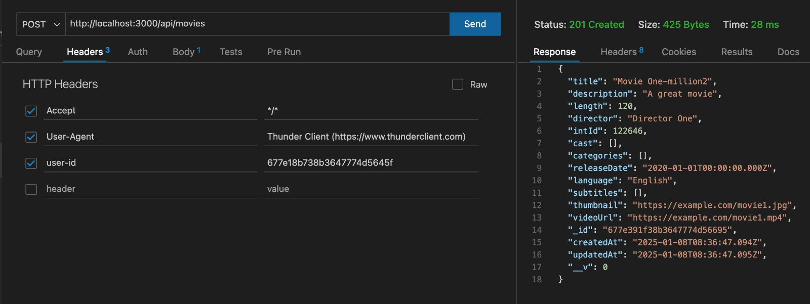
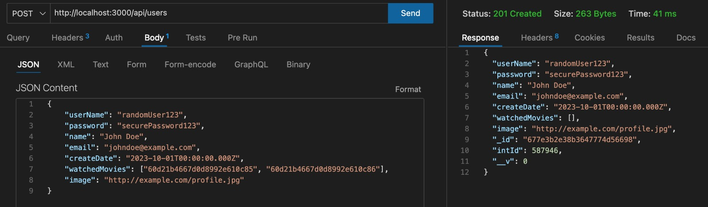
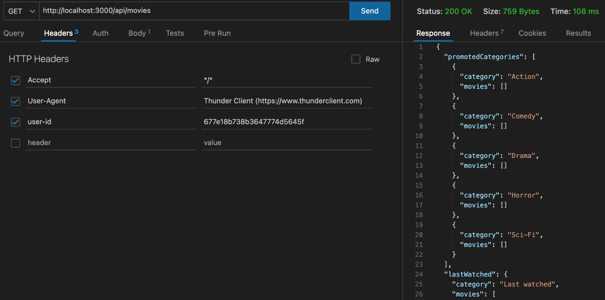

# Project Documentation

## CRUD Operations Overview

This project supports full **CRUD (Create, Read, Update, Delete)** operations for managing users, categories, and movies. All operations are handled through an HTTP server, with **Docker** managing the server environment.

You only need to send appropriate HTTP requests to interact with the system, ensuring that headers always include a valid `user-id`, which is required for all operations.

## Getting Started

First, clone the repository using:
```bash
git clone https://github.com/Yedidya-Darshan-code/netflix-proj-3.git
```
## Running the Project

### Starting with Docker

To start the project using Docker, follow these steps:

1. **Build the Docker image:**
  ```bash
  docker-compose up --build
  ```

2. **Then go to:**
  ```bash
  mongodb://localhost:27018/ProjDB
  ```
  This will start the application, exposing it on `http://localhost:3000`.

### Environment Setup

Create a `.env.docker` file in the project root with the following configuration for example:
```env
CONNECTION_STRING=mongodb://mongo:27017/ProjDB
PORT=3000
```

This configuration file is essential for Docker to properly connect to MongoDB and set up the server port.

## Endpoints and HTTP Methods

### Users

- **GET /api/users/{id}**  
  Retrieves a specific user by ID.  
  **Required Header:** `user-id`  
  **Example Request:**  
  ```bash
  curl -X GET http://localhost:3000/api/users/789 \
       -H "user-id: 123456"
  ```

- **POST /api/users**  
  Creates a new user.  
  **Required Header:** `user-id`  
  **Example Request:**  
  ```bash
  curl -X POST http://localhost:3000/api/users \
       -H "Content-Type: application/json" \
       -H "user-id: 123456" \
       -d '{"name": "John Doe", "email": "john@example.com"}'
  ```

### Tokens

- **POST /api/tokens**  
  Creates a new token.  
  **Required Header:** `user-id`  
  **Example Request:**  
  ```bash
  curl -X POST http://localhost:3000/api/tokens \
       -H "Content-Type: application/json" \
       -H "user-id: 123456" \
       -d '{"userId": "789", "expiration": "2024-12-31"}'
  ```

### Categories

- **GET /api/categories**  
  Retrieves the list of all categories.  
  **Required Header:** `user-id`  
  **Example Request:**  
  ```bash
  curl -X GET http://localhost:3000/api/categories \
       -H "user-id: 123456"
  ```

- **POST /api/categories**  
  Creates a new category.  
  **Required Header:** `user-id`  
  **Example Request:**  
  ```bash
  curl -X POST http://localhost:3000/api/categories \
       -H "Content-Type: application/json" \
       -H "user-id: 123456" \
       -d '{"name": "New Category"}'
  ```

- **PATCH /api/categories/{id}**  
  Updates an existing category by ID.  
  **Required Header:** `user-id`  
  **Example Request:**  
  ```bash
  curl -X PATCH http://localhost:3000/api/categories/67890 \
       -H "Content-Type: application/json" \
       -H "user-id: 123456" \
       -d '{"name": "Updated Category"}'
  ```

- **DELETE /api/categories/{id}**  
  Deletes a category by ID.  
  **Required Header:** `user-id`  
  **Example Request:**  
  ```bash
  curl -X DELETE http://localhost:3000/api/categories/67890 \
       -H "user-id: 123456"
  ```

### Movies

- **GET /api/movies**  
  Retrieves the list of all movies.  
  **Required Header:** `user-id`  
  **Example Request:**  
  ```bash
  curl -X GET http://localhost:3000/api/movies \
       -H "user-id: 123456"
  ```

- **POST /api/movies**  
  Creates a new movie.  
  **Required Header:** `user-id`  
  **Example Request:**  
  ```bash
  curl -X POST http://localhost:3000/api/movies \
       -H "Content-Type: application/json" \
       -H "user-id: 123456" \
       -d '{"title": "New Movie", "categories": ["67890"]}'
  ```

- **PUT /api/movies/{id}**  
  Updates an existing movie by ID.  
  **Required Header:** `user-id`  
  **Example Request:**  
  ```bash
  curl -X PUT http://localhost:3000/api/movies/101 \
       -H "Content-Type: application/json" \
       -H "user-id: 123456" \
       -d '{"title": "Updated Movie", "categories": ["67890"]}'
  ```

- **DELETE /api/movies/{id}**  
  Deletes a movie by ID.  
  **Required Header:** `user-id`  
  **Example Request:**  
  ```bash
  curl -X DELETE http://localhost:3000/api/movies/101 \
       -H "user-id: 123456"
  ```

### Recommendation Endpoint

- **GET /api/movies/{movie-id}/recommend**  
  Retrieves a list of recommended movies for the specified movie ID.  
    **Required Header:** `user-id`  
    **Example Request:**  
    ```bash
    curl -X GET http://localhost:3000/api/movies/101/recommend \
         -H "user-id: 123456"
    ```
    **Example Response:**  
    
    
    

    ### Error Handling

    All endpoints follow standard HTTP status codes:

    - **200 OK**: Request succeeded. Returns requested data
    - **201 Created**: Resource was successfully created
    - **400 Bad Request**: Invalid request syntax or parameters
    - **401 Unauthorized**: Authentication required or failed
    - **404 Not Found**: The requested resource doesn't exist
    - **500 Internal Server Error**: Server encountered an error

    Common error scenarios include:
    - Missing required headers
    - Invalid JSON format
    - Non-existent IDs
    - Server configuration issues

    Error responses include a message explaining the issue:
    ```json
    {
      "error": "Description of what went wrong"
    }
    ```

    ### Data Formats

    All request and response bodies use JSON format. Ensure the `Content-Type: application/json` header is set when sending data.

  *personal note:* 
  In terms of the previous project, we copied all the relevant code from Proj2 and placed it in a separate folder, making the necessary revisions to ensure the code functions properly for this use case.

