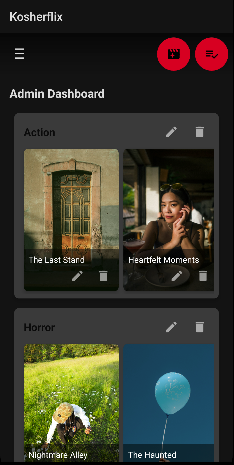
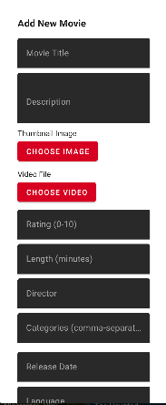
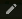
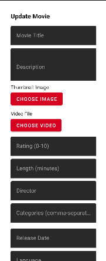
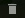
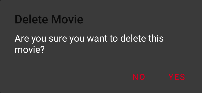
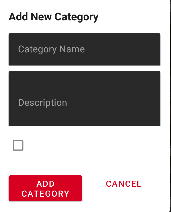
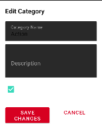
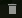
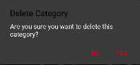

# Android Admin Homepage

## Introduction

The **Android Admin Homepage** is an exclusive section that allows administrators to manage movies and categories through the mobile interface. This feature is only accessible to users with admin privileges (when **isAdmin** is set to `true` in the database).

Note: When editing and adding make sure you fill in all required feilds and correctly otherwise you will get an error. For example, if you edit a movie but leave the title empty you will see:

### Main page

## How to Access the Admin Homepage

### Step 1: Grant Admin Privileges
To access the **Admin Homepage**, an admin account must be configured manually:
1. Navigate to your **database**.
2. Locate the user's record in the **users** collection.
3. Find the field named `isAdmin`.
4. Change its value from `false` to `true`.
5. Save the changes.

### Step 2: Logging In as an Admin
1. Log in using the credentials of the modified admin account. (You must manually make yourself an admin)
2. Locate the **Extention Button** at the top of the screen (The three bars)
3. Press the **Admin Panel** button

 
4. Now you can edit the application

---

## Admin Homepage Features

### 1. **Movie Management**
Admins can **add, update, or delete** movies from the platform.

- **Add Movie**  
  - Tap the **"+" button**.
  
  - Fill in details such as **title, description, release date, categories, director, and cast**.
  
  - Upload a **thumbnail** for the movie.
  - Upload a **video** for the movie
  - Tap **Save** to add the movie to the database.

- **Edit Movie**  
  - Navigate to a movie you want to edit.
  - Tap the edit icon in the bottom right of the movie card
  
  - Modify details such as title, description, or category.
   
  
  - Tap **Update** to save changes.

- **Delete Movie**  
  - Navigate to a movie you want to remove.
  - Tap the delete icon in the bottom left of the movie card
  
  - Confirm deletion in the alert dialog
   
  

### 2. **Category Management**
Admins can create and organize movie categories.

- **Add Category**  
  - Tap the **"Add Category"** button.
  
  - Enter a **category name and description** (e.g., Action, Comedy, Horror).
   
  
  - Toggle whether the category should be promoted
  - Tap **Save** to add the category.

- **Edit Category**  
  - Navigate to a category you want to edit.
  - Tap the edit icon to the right of the category
  
  - Modify details such as name or description.
   
  
  - Tap **Update** to save changes.

- **Delete Category**  
  - Navigate to a category you want to remove.
  - Tap the delete icon to the left of the category
  
  - Confirm deletion in the dialog
   
  

### 3. **Navigation & UI**
- **Top Navigation**: The Admin Homepage maintains the same **top navigation bar** as the regular app.
- **Return to Main Homepage**: Tap the **Home** icon in the bottom navigation to return to the homepage.

## Tips
- Only **trusted users** should be given admin access, as they have the ability to modify all movies and categories.
- Use meaningful category names to help users find movies easily.
