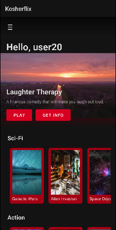
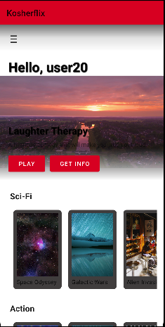
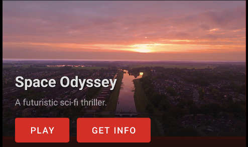
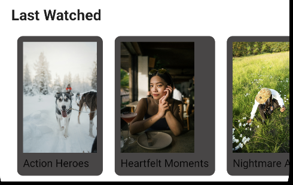
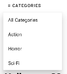
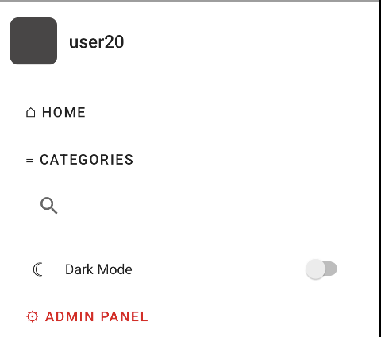

# Android Homepage

## Introduction

The **Android Homepage** serves as the main hub for users to discover and browse movies, access personalized features, and manage their viewing experience. The interface is optimized for mobile devices, featuring smooth scrolling and intuitive touch controls. For admin users, the profile section provides access to the admin interface.

## Key Features

- **Search Bar**: Quickly find movies using the search icon in the top bar
- **Theme Toggle**: Switch between light and dark themes in settings
- **Featured Movie**: Prominently displayed movie that changes periodically
- **Movie Categories**: Horizontal scrolling rows of movie categories
- **Recently Watched**: Quick access to previously viewed content

## Homepage Layout

### 1. **Theme Settings**

Access theme settings through the profile menu:
- **Dark Theme**: Optimized for low-light environments
- **Light Theme**: Bright interface for daytime use
- **System Default**: Follows system theme settings

### Dark Mode / Light Mode:

### 2. **Featured Movie**

The featured movie section occupies the top portion of the screen, displaying:
- **Movie Poster/Preview**: Large format display of the movie
- **Movie Title**: Prominently displayed
- **Quick Actions**: Play and Info buttons
- **Brief Description**: Short summary of the movie

### Example

### 3. **Movie Categories**

Below the featured movie, horizontally scrollable rows display different categories:
- **Action**
- **Comedy**
- **Drama**
- **Romance**
- **Documentary**

Each category shows movie posters that can be tapped to view details.

### Example

### 4. **Search Feature**

The search icon in the top bar opens the search interface:
- **Search Bar**: Enter movie titles or categories
- **Real-time Results**: Results update as you type
- **Recent Searches**: Quick access to previous searches

### Example

### 5. **Recently Watched**

The recently watched section appears as a horizontal row showing:
- **Previously watched movies** Shows a list of the last watched movies for the logged in user
- **Clickable** You can press one of the last watched movies to see details about it
- **Scrollable View** Allows the option to scroll between the recently watched movies seemlessly

### Example

### 6. **Extension Section**

The Three bars icon in the top navigation provides access to:
- **Home button**: Personal information and settings
- **View All Categories**: See all the categories at once
- **Admin Interface**: For users with admin privileges
- **Search Button**: Search for a specific movie

### Example

### 7. **Category Filter**

Access the category filter through the top bar:
- **All Categories**: View complete category list
- **Quick Filters**: Commonly used categories
- **Recently Used**: Recently selected categories

### Example

## Navigation

The app uses a top navigation bar with:
- **Home**: Return to main screen
- **Search**: Open search interface
- **Categories**: Browse all categories
- **Admin Panel**: Access admin mode

### Navigation Options

## Error Handling

- **Connection Issues**: Offline mode with cached content
- **Loading Errors**: Retry options with error messages
- **Search Failures**: Clear suggestions for refining search
