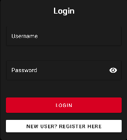

# Android Login & Registration

## Introduction

The **Login and Registration** system for the Android app provides a secure and user-friendly way to create and access accounts. The interface is optimized for mobile devices with easy form navigation and clear error feedback.

Note: When registering make sure you fill in all required feilds and correctly otherwise you will get an error. For example, if you dont enter a valid userName you will see:
 

### Homepage

## Registration Process

### Step 1: Initial Setup
1. Launch the app
2. Tap "Register" on the welcome screen
3. Fill in required information:
   - Username (3-15 characters)
   - Full Name (English letters only)
   - Email (valid format required)
   - Password (8+ characters, includes letters and numbers)
   - Profile Picture

### Example

### Step 2: Validation
- Username format check
- Email format verification
- Password strength requirements
- Real-time validation feedback

### Step 3: Confirmation
- Success message displayed
- Automatic redirect to login

## Login Process

### Step 1: Access
1. Launch the app
2. Tap "Login" on welcome screen
3. Enter credentials:
   - Username
   - Password

### Example

### Step 2: Authentication
- Credential verification

### Step 3: Success
- Welcome message

## Features

### Security
- Secure password storage

### User Experience
- Form auto-fill support
- Remember login option
- Password visibility toggle

## Error Handling

### Registration Errors
- Invalid email format
- Weak password
- Missing required fields

### Login Errors
- Invalid credentials
- Network connection issues
- Server unavailability

## Tips
- Use a strong, unique password

