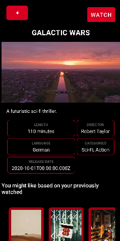
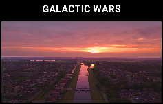
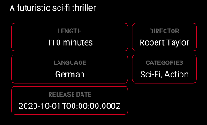
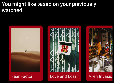

# Android Movie Details

## Introduction

The **Movie Details** screen provides comprehensive information about selected movies on the Android platform. This screen appears when users tap on any movie poster throughout the app. It features a **video preview**, detailed movie information, and personalized movie recommendations based on viewing history.

---

## Movie Details Features

### 1. **Watch Movie Button**
A prominent **Play** button appears at the top of the screen.

- Tapping the button starts the movie in the **Movie Player**.

### 2. **Video Preview**
The preview section automatically plays a short clip:

- **Auto-play**: Begins when the screen loads
 

### 3. **Movie Information**
Below the preview, you'll find:

- **Title**: Movie name
- **Description**: Plot summary
- **Duration**: Total runtime
- **Director**: Director's name
- **Release Date**: Original release date
- **Language Options**: Audio and subtitle availability
- **Additional Details**: Cast, ratings, etc.

### 4. **Similar Movies**
At the bottom, a horizontally scrollable list shows recommended movies:

- **Personalized**: Based on viewing history

---

## Navigation

### Accessing Movie Details
1. **Find a movie** through:
   - Homepage browsing
   - Search results
   - Recently watched list
2. **Tap the movie poster** to open details
3. **View information** and preview content
4. **Tap Play** to start watching or select another recommended movie

## Features

### Navigation
- **Back Button**: Returns to previous screen
---

## Tips
- **Rotate Device**: Landscape mode for better preview viewing
- **Check Network**: Ensure stable connection for smooth preview playback
