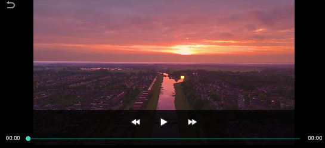

# Android Movie Player

## Introduction

The **Android Movie Player** provides a seamless streaming experience optimized for mobile devices.

### Example

 

---

## Player Features

### 1. **Video Playback Controls**
- **Play/Pause**: Tap button to toggle play / pause

### 2. **Viewing Modes**

- **Full-Screen**:
---

## How to Use

### Basic Controls
1. **Start Playback**
   - Tap the play button or screen center
   - Video begins in portrait mode by default

4. **Exit Playback**
   - Tap back button

---
