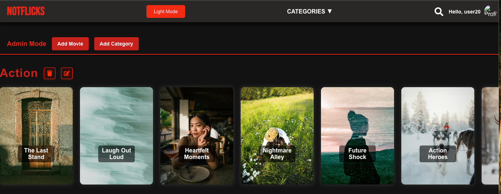
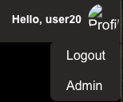
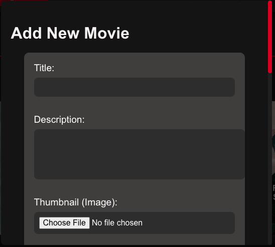
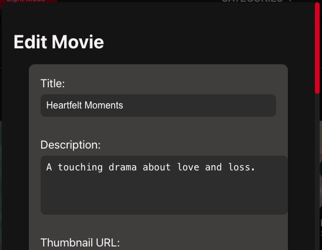
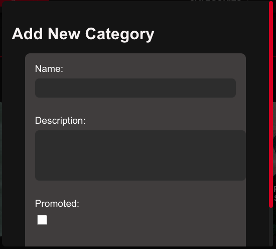
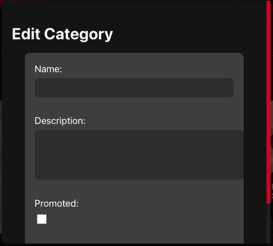
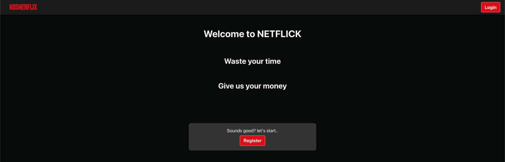

# Admin Homepage

## Introduction

The **Admin Homepage** is an exclusive page that allows administrators to manage the movie catalog and categories. Admin users have the ability to **create, update, and remove** movies and categories directly from this interface. This page is not visible to regular users and can only be accessed when the **isAdmin** field is manually set to `true` in the database.

The Admin Homepage retains the same **navbar** as the regular homepage, ensuring easy navigation back to the main site.

### Main page

## How to Access the Admin Homepage

### Step 1: Grant Admin Privileges
To access the **Admin Homepage**, an admin account must be configured manually:
1. Navigate to your **database**.
2. Locate the user's record in the **users** collection.
3. Find the field named `isAdmin`.
4. Change its value from `false` to `true`.
5. Save the changes.

### Step 2: Logging In as an Admin
1. Log in using the credentials of the modified admin account.
2. Click on the **Profile Picture** in the top-right corner.
3. You will now see an additional option in the dropdown labeled **Admin**.
4. Click **Admin** to navigate to the **Admin Homepage**.

### Example

---

## Admin Homepage Features
Note: When editing and adding make sure you fill in all required feilds and correctly otherwise you will get an error. For example, if you edit a movie but leave the title empty you will see:

### 1. **Movie Management**
Admins can **add, update, or delete** movies from the platform.

- **Add Movie**  
  - Click the **"Add Movie"** button.
  - Fill in details such as **title, description, release date, categories, director, and cast**.
  - Upload a **thumbnail** for the movie.
  - Upload a **video** for the movie
  - Click **Save** to add the movie to the database.

  
  

- **Edit Movie**  
  - Navigate to a movie you want to edit.
  - Click the edit button in the bottom right of the movie
  - Modify details such as title, description, or category.
  - Click **Update** to save changes.

  
  

- **Delete Movie**  
  - Navigate to a movie you want to remove.
  - Click the remove button in the bottom left of the movie
  - Click to confirm you want to delete the movie

  

### 2. **Category Management**
Admins can create and organize movie categories.

- **Add Category**  
  - Click the **"Add Category"** button.
  - Enter a **category name and description** (e.g., Action, Comedy, Horror).
  - Select whether the category should be promoted or not
  - Click **Save** to add the category.

  
  

- **Edit Category**  
  - Navigate to a category you want to edit.
  - Click the edit button to the right of the category
  - Modify details such as name or description.
  - Click **Update** to save changes.

  
  

- **Delete Category**  
  - Navigate to a category you want to remove.
  - Click the remove button to the left of the category
  - Click to confirm you want to delete the category

  

### 3. **Navigation & UI**
- **Navbar**: The Admin Homepage retains the same **navbar** as the regular homepage.
- **Return to Main Homepage**: Click the **Notflicks logo** in the navbar to return to the homepage.

### 4. **Whats's stopping me from just going straight to the admin page?**

I'm glad you asked. When trying to navigate to /admin page without actually being an admin
 

 
You will be redirrected to the login page as punnishment and this likely will be reported:

---

## Error Handling
- **Admin Page Not Visible**  
  - Ensure the `isAdmin` field in the database is set to `true`.
  - Log out and log back in after making the change.
  
- **Failed to Add/Update/Delete Movie**  
  - Check if all required fields are filled.
  - Ensure the movie title is unique.
  - Verify the server connection.

- **Category Deletion Warning**  
  - If a category is deleted, all movies linked to it may become unclassified.

---

## Tips
- Only **trusted users** should be given admin access, as they have the ability to modify all movies and categories.
- Regularly **backup** the database to prevent accidental deletions.
- Use meaningful category names to help users find movies easily.

