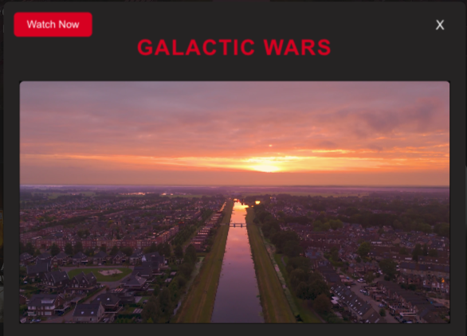
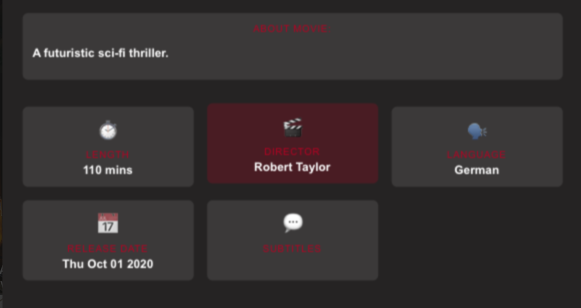
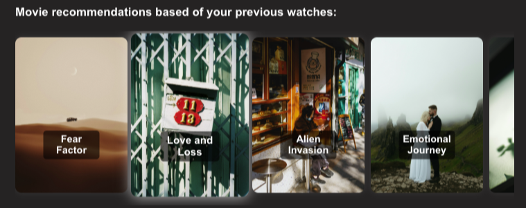
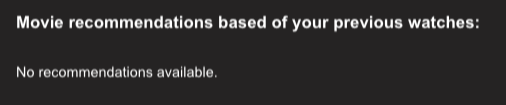

# Movie Details

## Introduction

The **Movie Details** popup provides users with an overview of a selected movie, including a short **video preview**, movie information, and a list of **recommended movies** based on the user's watch history. It enhances the browsing experience by allowing users to decide whether they want to watch the movie or explore similar recommendations.

This popup appears when a user clicks on a movie from the **Homepage**, **Search Results**, or **Last Watched List**.

---

## Movie Details Popup Features

### 1. **Watch Movie Button**
At the top of the popup, a large **Watch Movie** button is displayed.

- Clicking this button redirects the user to the **Movie Player Page**, where they can stream the full movie.
- If the movie is restricted by age, a warning will appear before allowing access.
- If there are issues loading the movie, an error message will be displayed.

### 2. **Video Preview**
Below the watch movie button, a **short video preview** (such as a trailer or a scene) plays automatically. This helps users get a quick feel for the movie before deciding to watch it.

- **Auto-play feature**: The preview starts playing as soon as the popup opens.
- **Muted by default**: Users can unmute the preview if they want to hear the sound.

### 3. **Movie Information**
Below the **Movie Preview**, detailed information about the selected movie is shown:

- **Title**: The name of the movie.
- **Description**: A brief summary of the movie plot.
- **Length**: Total runtime of the movie.
- **Director**: Name of the movie's director.
- **Release Date**: The date the movie was released.
- **Language & Subtitles**: The movie's original language and available subtitle options.
- **And more**

### 4. **Recommended Movies**
At the bottom of the popup, a **Recommended Movies** section suggests similar movies based on the user’s watch history.

- The recommendations are **personalized** using the user’s previously watched genres and preferences.
- Each recommended movie is displayed as a **thumbnail with its title**.
- Clicking on a recommended movie will open its **Movie Details Popup**.

---

## How to Access the Movie Details Popup

### **In the Web App**
1. **Navigate to the homepage** and browse the movie catalog.
2. **Click on any movie** from the **Promoted Categories, Search Results, or Last Watched List**.
3. The **Movie Details Popup** will appear, displaying the **preview, details, and recommendations**.
4. Click **"Watch Movie"** to start streaming or click another **recommended movie** to view its details.

---

## Error Handling
- **Video Preview Not Loading**  
  - If the video preview fails, a **static movie poster** is displayed instead.
  - The user can still click "Watch Movie" to access the full movie.

- **No Recommendations Available**  
  - If there are no previous watch history records, the recommendation section displays **no recommendations found** instead.

  

- **Movie Details Not Found**  
  - If the movie is removed from the database, an error message appears:  
    `"This movie is no longer available."`

---

## Tips
- If you want more recommendations, **watch more movies** to improve the system’s suggestions.
- Use the **Search Bar** if you don’t find a movie you like in the recommended list.

---