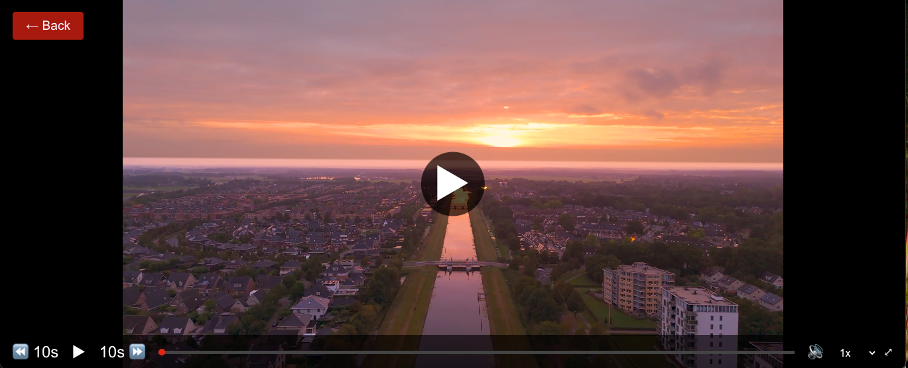
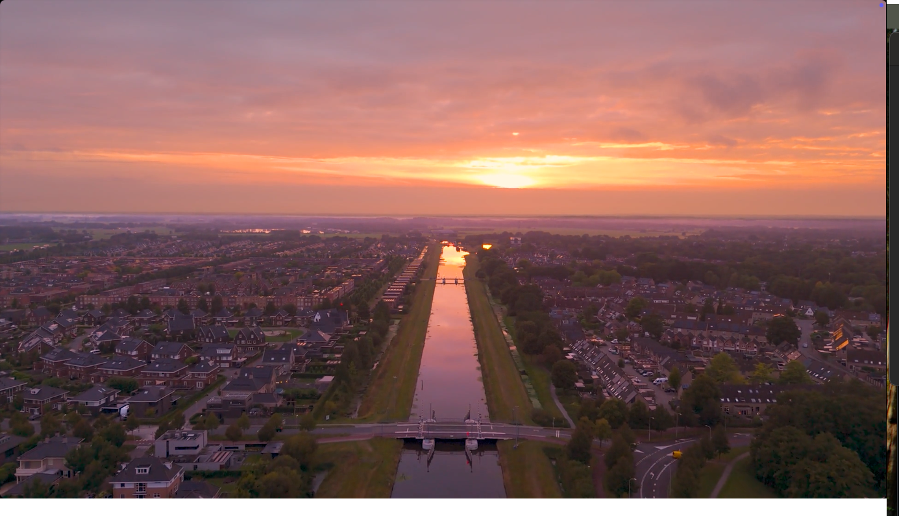

# Movie Player

## Introduction

The **Movie Player Page** allows users to stream movies directly within the application. It provides a **smooth playback experience**, essential controls, and an optimized interface.

Once a user selects a movie and clicks **"Watch Movie"**, they are redirected to this page, where they can enjoy the full-length movie.

### Example

---

## Movie Player Features

### 1. **Video Playback**
- **Full-Screen Mode**: Users can toggle full-screen for an immersive experience.
- **Pause/Play Controls**: Easily pause or resume playback.
- **Seek Bar**: Jump to a specific part of the movie.
- **Volume Control**: Adjust the volume or mute the movie.
- **Playback Speed**: Adjust the playback speed with ease up to 2x.

### 2. **Last Watched Tracking**
- When a user **pauses** or **exits**, the movie is **saved in the Last Watched List**.

### 3. **Keyboard & Gesture Controls**
- **For Web:**
  - Press `Space` to pause/play.
  - Use `→` and `←` arrow keys to skip forward/backward.
  - Press `F` to enter full-screen mode and `Esc` to exit.
  - Press `M` to mute/unmute.

### 4. **Exit & Navigation**
- Click the **Back Button** (←) to return to the **Homepage**.

---

## How to Access the Movie Player

### **In the Web App**
1. Select a movie from the **homepage, search results, or last watched list**.
2. Click **"Watch Movie"** in the **Movie Details Popup**.
3. The **Movie Player Page** opens, playing the full movie.

---

## Error Handling
- **Movie Not Loading**  
  - Ensure the **server is running** and the video URL is correct.
  - Check if the movie file exists on the backend.

---

## Tips
- **Use Full-Screen Mode** for a cinematic experience.
- Watch on the speed that best suites you using the **speed control** in the control bar.

---
