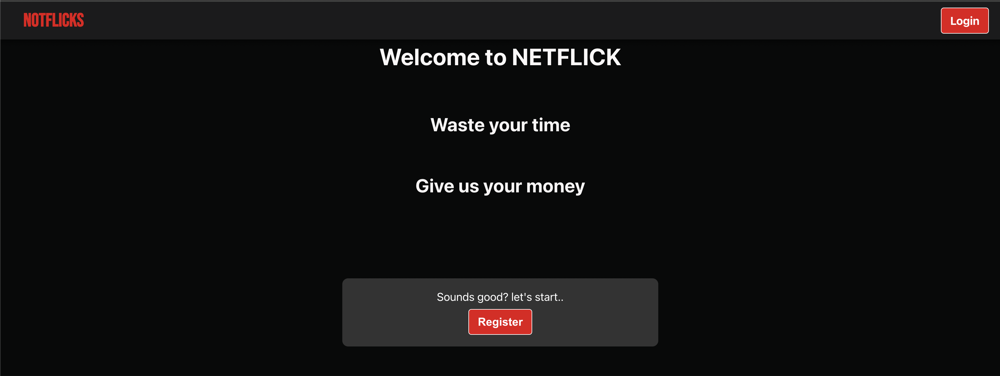

# User Registration

## Introduction

The **Registration** process allows new users to create an account on the platform. Once registered, users can log in to access personalized features such as browsing movies, creating watchlists, and viewing movie details.

Note: When registering make sure you fill in all required feilds and correctly otherwise you will get an error. For example, if you dont enter a valid userName you will see:
 

### Welcome Page

## Key Features
- **Create Account**: New users can sign up by providing basic details like name, email, and password.
- **Responsive Interface**: The registration form is designed to be responsive, ensuring a smooth experience on both desktop and mobile devices.

## Registration Flow

1. **User Input**: The user provides necessary information such as:
   - Full Name
   - Email Address
   - userName
   - Password
   - Profile Picture
   
2. **Backend Validation**: The backend verifies that the email address is unique and checks if the password meets the minimum requirements (e.g., length, special characters).

3. **Account Activation**: After uniqueness validation, the user can log in with their new account credentials.

## Registration in Web App

### Step-by-Step Instructions

1. Navigate to the **Registration Page** from the homepage or the login page.
2. Fill out the registration form with your full name, email address, and a secure password.
3. Click the **Register** button to submit the form.
6. Now you should be able to log in using your credentials.

### Example

For any problems with registration please contact our help office at YedYoniElroi@barilan.com or call 1800-KOSHER1