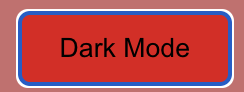
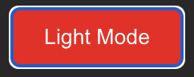
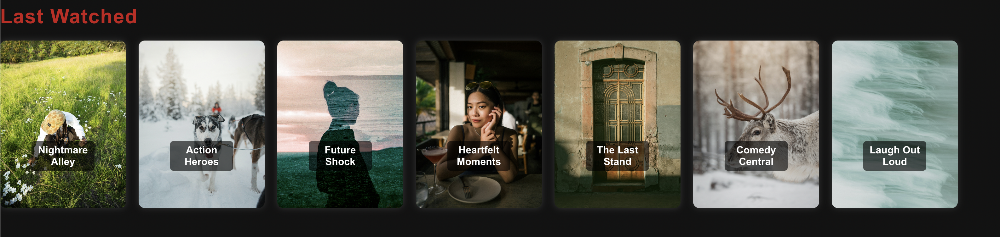
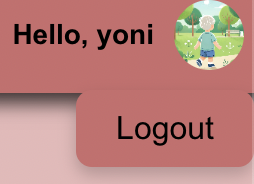
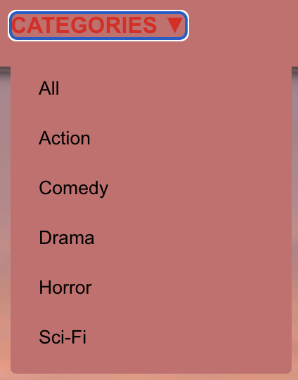
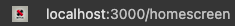

# Homepage

## Introduction

The **Homepage** is the central hub where users can browse movies, discover new content, and access personalized features. It provides an engaging and interactive layout, including a search feature, promoted movie categories, and a dynamic movie display. Additionally, if the user is an admin, the profile button grants access to the admin page.

## Key Features

- **Search Bar**: Quickly find movies by title or category.
- **Dark Mode / Light Mode Toggle**: Switch between a dark and light theme to customize the user interface.
- **Random Movie Display**: A featured movie displayed at the top of the homepage, changing dynamically.
- **Promoted Movie Categories**: Rows of movie categories (e.g., Action, Comedy) that are displayed with their respective movies.
- **Last Watched List**: Displays movies the user has previously watched, offering quick access to their viewing history.
- **Profile Button**: For non-admin users, it opens the user’s profile. For admins, it navigates to the **Admin Page**.

## Homepage Layout

### 1. **Random Movie Display**

At the top of the homepage, a randomly selected movie is prominently displayed. This section gives the user a quick recommendation based on what’s available in the movie catalog.

- **Movie Poster**: The poster of the randomly selected movie.
- **Movie Title**: The name of the movie.
- **Details Button**: Clicking this button takes the user to the **Movie Details** page for more information about the movie.
- **Play Button**: Directs to the **Movie Player** page for streaming.

### Example

### 2. **Promoted Categories**

Below the random movie display, there are multiple rows of promoted categories, such as:
- **Action**
- **Comedy**
- **Drama**
- **Romance**
- **Documentary**

Each category contains a horizontally scrollable list of movie posters. Clicking on a movie takes the user to the **Movie Details** page.

### Example

### 3. **Search Bar**

At the top of the homepage, there is a **Search Bar** allowing users to search for movies by name, genre, or category. Once a user types a query, suggestions are displayed in real-time.

- **Search Field**: Type the movie title or category.
- **Search Results**: Displays matching movies below the search bar.

### Example

### 4. **Dark Mode / Light Mode Toggle**

The homepage allows the user to toggle between **Dark Mode** and **Light Mode**. This toggle button is positioned at the top-right of the homepage.

- **Dark Mode**: The interface switches to a darker color palette to reduce eye strain.
- **Light Mode**: The interface switches to a lighter color palette.

### Example

### 5. **Last Watched List**

At the bottom of the homepage, the **Last Watched List** shows movies the user has previously watched. This section helps users easily pick up where they left off.

- **Watched Movies**: A row showing the most recent movies the user watched.

### Example

### 6. **Profile Button**

At the top-right of the homepage, the **Profile Button** offers different functionality depending on the user’s role:
- **Regular User**: Clicking the profile button opens the user’s profile page, where they can view or update personal information, manage watchlists, etc.
- **Admin User**: Clicking the profile button navigates the user to the **Admin Page**, where they can manage the movie catalog, user accounts, and more.

### Example

### 7. **Category Selector**

In the middle of the navigation bar you can open a dropdown menu to filter movies to a **single category** or all of them (not just the promoted ones)

### Example

### 8. **Whats's stopping me from just going straight to the homescreen page without logging in?**

What a great question! When trying to navigate to /homescreen page without a valid token given from logging in,
 

 
You will be redirrected to the login page as punnishment and this likely will be reported:

### Step-by-Step Instructions

1. Upon logging in, you are redirected to the homepage.
2. The **Random Movie Display** shows a featured movie at the top of the page.
3. Below the random movie, you will see various **Promoted Categories**.
4. Use the **Search Bar** at the top to find specific movies or genres.
5. Toggle between **Dark Mode** and **Light Mode** using the button at the top-right.
6. At the bottom, the **Last Watched List** shows movies you've recently watched.
7. Click the **Profile Button**:
   - If you're a regular user, it opens your profile.
   - If you're an admin, it opens the **Admin Page**.

## Error Handling

- **No Movies Found**: If a search yields no results, a message will be displayed saying "No movies found." The user can refine the search or explore promoted categories.
- **Random Movie Display**: If the backend fails to fetch the random movie, a placeholder image or message is displayed until the system recovers.
- **Last Watched List Empty**: If the user hasn’t watched any movies yet, the last watched list will show a message like "Start watching to see your list here."

## Tips

- **Dark Mode** is ideal for viewing at night or in low-light environments, while **Light Mode** is better for daytime use.
- If you're looking for specific genres or movie types, use the **Search Bar** to quickly locate content.
- Keep track of your **Last Watched List** to easily continue watching movies you’ve started.

For any problems with registration please contact our help office at YedYoniElroi@barilan.com or call 1800-KOSHER1